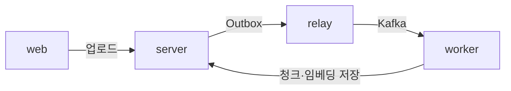
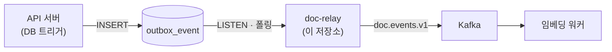
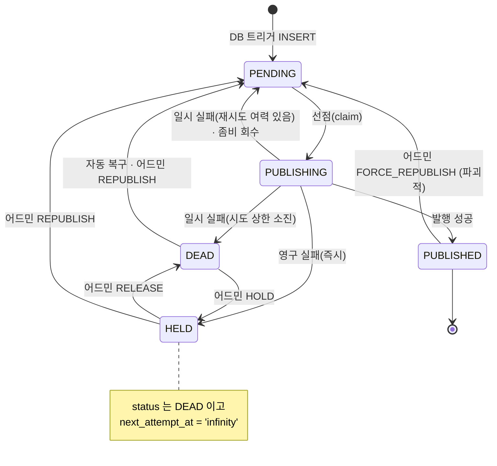

[한국어](README.md) / [English](README_EN.md)

# AI 문서 관리 시스템 — Outbox 릴레이 서버


> 2026 오픈소스 개발자 대회 · 티맥스티베로 기업 과제

문서 저장과 함께 남은 인덱싱 요청 이벤트를 **하나도 잃지 않고** 카프카로 옮기는 릴레이 서버입니다. 트랜잭션과 메시지 발행이 갈라지는 지점을 메우고, 중간에 무엇이 죽더라도 이벤트가 결국 나가도록 재시도와 회수를 책임집니다.

---

## 개요

이 시스템은 문서를 올려 두면 필요할 때 의미로 찾아 주고, 그 사이의 인덱싱 과정은 사람이 신경 쓰지 않아도 되도록 만듭니다.

그래서 업로드 응답은 인덱싱을 기다리지 않습니다. 대신 API 서버가 문서를 저장하는 트랜잭션과 **같은 원자 단위로** 인덱싱 요청 이벤트를 `outbox_event` 에 남기고, 이 서버가 그 행을 카프카로 옮깁니다. 이벤트 행은 DB 트리거가 만들기 때문에 애플리케이션이 발행을 빠뜨릴 수 없고, 저장이 롤백되면 이벤트도 함께 사라집니다. 발행에 실패해도 행은 테이블에 남아 있으므로 원인이 사라지면 언젠가는 나갑니다.

<br>

시스템을 구성하는 소스 코드 저장소는 총 4개입니다. 업로드한 문서는 아래의 과정을 통해 최종 검색 가능한 상태가 됩니다.



| 저장소 | 역할 |
|---|---|
| [server](https://github.com/mash-up-kr/spr1n6-osscontest-server) | API 서버. 업로드·권한·검색을 담당하고 Outbox 이벤트를 남깁니다 |
| [relay](https://github.com/mash-up-kr/spr1n6-osscontest-relay) | Outbox 행을 읽어 카프카로 발행합니다 |
| [worker](https://github.com/mash-up-kr/spr1n6-osscontest-worker) | 문서를 청크로 나누고 임베딩해 저장합니다 |
| [web](https://github.com/mash-up-kr/spr1n6-osscontest-web) | React SPA |

이 저장소는 `relay`입니다.

---

## 핵심 기능

### 유실 없는 이벤트 발행

API 서버가 문서 버전을 저장하면 DB 트리거가 `outbox_event` 에 이벤트 행을 남깁니다. 이 서버는 그 테이블을 지켜보다가 발행할 차례가 된 행을 선점해 Kafka 로 보내고, 결과를 다시 행 상태로 기록합니다. **Transactional Outbox 의 릴레이**이며, 이벤트는 적어도 한 번(at-least-once) 전달됩니다.



`LISTEN` 으로 새 행을 곧바로 감지하고, 알림이 유실되더라도 주기 폴링이 안전망으로 남습니다. 여러 대를 띄워도 `SKIP LOCKED` 로 같은 행을 두 번 집지 않습니다.

### 스스로 복구하는 재시도

발행에 실패하면 시도할 때마다 간격을 두 배로 넓혀 다시 시도하고, 상한에 닿으면 `DEAD` 로 보냅니다. 발행 도중 릴레이가 죽어 `PUBLISHING` 에 갇힌 행은 잠금 타임아웃이 지나면 회수합니다.

시도 상한을 소진해 `DEAD` 가 된 행은 복구 지연이 지나면 스스로 `PENDING` 으로 돌아와 다시 줄을 섭니다. 반면 다시 시도해도 결과가 달라지지 않는 실패 — 봉투 조립 실패, 레코드 크기 초과, 토픽 권한·이름 오류 — 는 재시도 없이 곧바로 `DEAD` 로 보내고 `next_attempt_at` 을 `infinity` 로 두어 자동 복구 대상에서 뺍니다. 이 행들은 사람이 `RELEASE` 로 자동 복구 대상에 되돌리거나 `REPUBLISH` 로 즉시 다시 보낼 때까지 그대로 멈춰 있고, 어드민 조회에서 `held` 로 따로 세어집니다.



### 좁게 잡은 책임 경계

릴레이가 건드릴 수 있는 범위를 의도적으로 줄였습니다.

- **INSERT / DELETE 를 하지 않습니다.** 행 생성은 API 서버 쪽 DB 트리거의 몫이고, 릴레이의 모든 쓰기는 UPDATE 입니다. 어드민 재발행조차 새 행을 만들지 않고 기존 행을 되돌립니다.
- **Kafka 를 소비하지 않습니다.** 구독은 임베딩 워커의 몫이고, 워커가 `eventId` 로 멱등 처리해 중복 발행을 흡수합니다.
- **HTTP 요청을 받지 않습니다.** `server.port: -1` 로 애플리케이션 포트 자체가 열리지 않고, 관리 포트만 뜹니다.
- **payload 를 해석하지 않습니다.** JSONB 원문을 그대로 봉투에 실어 보냅니다.

### 운영자를 위한 관측과 조작

상태별 건수와 발행을 포기한 이벤트 목록을 어드민 엔드포인트로 확인하고, 이벤트 하나를 골라 재발행하거나 멈출 수 있습니다. 자동 복구가 시도 횟수를 리셋하기 때문에 DB 만 봐서는 알 수 없는 무한 순환도 Prometheus 카운터로 잡아냅니다. 자세한 사용법은 [운영](#운영)에 있습니다.

---

## 시작하기

### 요구 사항

- JDK 21 이상
- Docker & Docker Compose

### 실행

릴레이·PostgreSQL·Kafka 를 한 번에 띄웁니다. 이미지가 실제로 DB/카프카에 붙는지 확인하는 스모크 테스트용이자, 팀 통합 컴포즈에 relay 서비스를 옮겨 붙일 때 베껴 갈 레퍼런스입니다.

```bash
docker compose up -d --build
curl localhost:9090/actuator/health
```

`outbox_event` 스키마는 원래 API 서버의 마이그레이션이 만듭니다. 이 스택에는 API 서버가 없으므로 `demo/seed.sql` 이 대신 만듭니다 — **이 시드를 통합 스택에 가져가면 안 됩니다.**

기동 시 `SchemaValidator` 가 `outbox_event` 가 기대한 형태인지 검사하고, 아니면 기동을 중단합니다. 통합 스택에서 릴레이가 API 서버보다 먼저 뜨면 한 번 죽는 것이 정상이고, `restart` 에 맡겨 두면 스키마가 생긴 뒤 알아서 붙습니다.

### 접속

| 대상 | 주소 |
|---|---|
| 관리 포트 (액추에이터) | `http://localhost:9090` |
| PostgreSQL | `localhost:5432` |
| Kafka | `localhost:9092` |

### 종료

```bash
docker compose down       # 컨테이너만 정리합니다
docker compose down -v    # 볼륨까지 지워 스키마를 다시 만듭니다
```

### 로컬 실행 (호스트에서 직접)

DB·Kafka 만 컨테이너로 띄우고 릴레이는 호스트에서 실행합니다. `demo` 프로파일이 접속 정보와 짧은 타이밍 값을 함께 들고 있습니다.

```bash
docker compose -f demo/docker-compose.yml up -d
docker compose -f demo/docker-compose.yml exec -T postgres \
  psql -U docrelay -d docrelay < demo/seed.sql

./gradlew bootRun --args='--spring.profiles.active=demo'
```

### 장애 주입 데모

`demo/run.sh` 는 정상 발행부터 릴레이 강제 종료, 카프카 중단, LISTEN 커넥션 절단까지 다섯 가지 시나리오를 돌리고, 매번 `demo/verify.sh <기대 건수>` 로 "INSERT 건수 == 카프카에 도착한 고유 `eventId` 건수" 를 확인합니다.

```bash
chmod +x demo/run.sh demo/verify.sh
./demo/run.sh
```

자세한 내용은 [장애 주입 데모](demo/README.md)에 있습니다.

### 테스트

Testcontainers 로 PostgreSQL 과 Kafka 를 띄우므로 Docker 가 실행 중이어야 합니다.

```bash
./gradlew test
```

### 환경 변수

컨테이너로 띄울 때 필요한 값입니다. Spring 표준 키를 그대로 쓰므로 별도 `.env.example` 은 두지 않습니다.

| 변수명 | 필수 | 설명 |
|---|:--:|---|
| `SPRING_DATASOURCE_URL` | O | `jdbc:postgresql://<db-host>:5432/<db>` |
| `SPRING_DATASOURCE_USERNAME` | O | 접속 계정 |
| `SPRING_DATASOURCE_PASSWORD` | O | 접속 비밀번호 |
| `SPRING_KAFKA_BOOTSTRAP_SERVERS` | O | 브로커 주소. 컴포즈 안에서는 컨테이너 간 리스너 주소를 씁니다 |
| `RELAY_KAFKA_TOPIC` | X | 발행 토픽 (기본 `doc.events.v1`) |
| `RELAY_KAFKA_PARTITIONS` | X | 토픽 파티션 수 (기본 3) |
| `RELAY_ADMIN_TOKEN` | X | 어드민 쓰기 액션 토큰. 비어 있으면 인증이 꺼집니다 |
| `RELAY_INSTANCE_ID` | X | `locked_by` 에 남길 이름 (기본 `HOSTNAME`). 여러 대를 띄우면 서로 달라야 합니다 |
| `TZ` | X | 타임존. 스택 전체를 `Asia/Seoul` 로 맞춥니다 |

접속 정보는 커밋하지 않습니다. 이미지는 접속 정보를 하나도 들고 있지 않습니다.

### 릴레이 튜닝 값

시간값과 상한은 모두 `relay.*` 로 모여 있고, 코드 어디에도 숫자를 직접 박지 않습니다. 기본값은 운영 기준입니다.

| 키 | 기본값 | 설명 |
|---|---|---|
| `relay.drain.batch-size` | 100 | 한 사이클에 선점할 행의 최대 개수 |
| `relay.polling.interval` | 10s | 알림이 유실돼도 이 주기로 확인하는 최후의 안전망 |
| `relay.backoff.base` / `max` | 10s / 5m | 실패할 때마다 두 배가 되고 `max` 를 넘지 않습니다 |
| `relay.backoff.max-attempts` | 5 | 이 횟수에 닿으면 `DEAD` 로 보냅니다 |
| `relay.dead.recovery-delay` | 10m | `DEAD` 행이 다시 `PENDING` 이 되기까지의 대기 |
| `relay.zombie.lock-timeout` | 5m | 선점만 하고 끝나지 않은 행을 회수하는 기준 |
| `relay.listener.channel` | `outbox_event` | `LISTEN` 할 채널. DB 트리거의 `pg_notify` 와 맞춥니다 |
| `relay.shutdown.drain-timeout` | 30s | 정상 종료 시 진행 중인 사이클을 기다리는 상한 |

기동 시 `BudgetValidator` 가 이 값들의 관계(한 사이클 상한 < 좀비 회수 타임아웃)를 검사하고, 어긋나면 기동을 중단합니다. 컨테이너의 `stop_grace_period` 는 `drain-timeout` 보다 길어야 합니다 — 짧으면 드레인이 끝나기 전에 `SIGKILL` 이 날아갑니다.

---

## 프로파일 구성

애플리케이션 코드는 어느 프로파일에서나 동일합니다. 접속 정보를 어디서 받는지와 타이밍 값만 다릅니다.

| 항목 | 기본 (프로파일 없음) | `demo` | `docker` |
|---|---|---|---|
| 용도 | 운영 · 테스트 | 호스트에서 띄우는 장애 주입 데모 | 컨테이너 실행 |
| 접속 정보 | 환경변수 (테스트는 Testcontainers) | `application-demo.yaml` 직접 명시 | 환경변수 |
| 관리 포트 바인드 | `127.0.0.1` | `127.0.0.1` | `0.0.0.0` |
| 백오프 | 10s → 5m, 5회 | 2s → 20s, 5회 | 기본값 |
| DEAD 복구 지연 | 10분 | 30초 | 기본값 |
| 폴링 주기 | 10초 | 3초 | 기본값 |

`docker` 프로파일에는 접속 정보를 두지 않습니다. 이 이미지는 어느 스택에 얹힐지 모르는 채로 배포되므로 DB/카프카 주소는 띄우는 쪽이 환경변수로 넣는 것이 맞습니다. 이미지 안에 `localhost` 를 박아 두면 컨테이너 안에서의 `localhost` 는 자기 자신이라 아무 데도 붙지 못합니다.

---

## 운영

관리 포트(9090)만 열리고, 기본 바인드 주소는 `127.0.0.1` 입니다. 접근하려면 서버에 직접 들어가거나 SSH 터널이 필요합니다.

### 어드민 엔드포인트

```bash
# 상태별 건수
curl localhost:9090/actuator/outbox
# → { "pending": 12, "publishing": 3, "dead": 5, "held": 1 }

# 발행을 포기한 이벤트 목록
curl localhost:9090/actuator/outbox/dead

# 이벤트 하나 조작 (RELAY_ADMIN_TOKEN 을 설정했다면 본문에 "token" 을 함께 넣습니다)
curl -X POST localhost:9090/actuator/outbox/{eventId} \
     -H 'Content-Type: application/json' -d '{"action":"HOLD"}'
```

| action | 하는 일 | 언제 |
|---|---|---|
| `REPUBLISH` | `PENDING` + 시도 횟수 0 + 즉시 발행 신호 | 원인을 고쳤으니 지금 보내고 싶을 때 |
| `HOLD` | `next_attempt_at = 'infinity'` | 무한 순환하는 독성 이벤트를 멈출 때 |
| `RELEASE` | `next_attempt_at = now()` | `HOLD` 를 풀 때 |
| `FORCE_REPUBLISH` | 이미 끝난 발행을 되돌립니다 (파괴적) | 소비 측 사고로 재전달이 필요할 때 |

### 메트릭

`/actuator/prometheus` 에서 봅니다.

| 종류 | 메트릭 |
|---|---|
| 카운터 | `relay_publish_total{result}`, `relay_dead_transition_total`, `relay_dead_recovery_total`, `relay_zombie_reclaim_total`, `relay_listener_reconnect_total`, `relay_forced_republish_total`, `relay_stale_write_total`, `relay_mark_failure_total` |
| 게이지 | `relay_outbox_pending`, `relay_outbox_dead`, `relay_outbox_held`, `relay_listener_connected` |
| 분포 | `relay_publish_latency_seconds{attempt}`, `relay_drain_batch_size` |

`relay_dead_transition_total` 은 오르는데 `relay_publish_total{result="success"}` 가 제자리라면 같은 이벤트가 `DEAD ↔ PENDING` 을 무한 순환하는 것입니다. 자동 복구가 시도 횟수를 0 으로 리셋하기 때문에 **DB 만 봐서는 몇 번째 순환인지 알 수 없고**, 이 카운터가 순환을 관측하는 유일한 창입니다. 범인을 찾으면 `HOLD` 로 멈춥니다.

### 헬스 체크

헬스 그룹은 두 가지로 나뉩니다. 드레인 스레드가 죽으면 재시작으로 낫는 문제라 `liveness` 에 넣고, LISTEN 커넥션이 끊긴 것은 폴링이 대신 동작하므로 넣지 않습니다.

```bash
curl localhost:9090/actuator/health/liveness    # drainer
curl localhost:9090/actuator/health/readiness   # db, drainer
```

---

## 기술 스택

| 구분        | 기술                            | 버전     |
|-----------|-------------------------------|--------|
| Language  | Kotlin                        | 2.3.21 |
| Runtime   | Java (JVM)                    | 21 LTS |
| Framework | Spring Boot                   | 4.1.0  |
| DB 접근     | Spring Data JDBC (JdbcClient) | 4.1.x  |
| 메시징       | Spring for Apache Kafka       | 4.1.0  |
| Broker    | Apache Kafka                  | 4.0.0  |
| Build     | Gradle (Kotlin DSL)           | 9.5.1  |
| DB (dev)  | Tmax OpenSQL                  | v3.0   |
| DB (로컬)   | PostgreSQL                    | 17     |
| Driver    | PostgreSQL JDBC               | 42.7.x |
| 관측        | Micrometer / Prometheus       | 1.17.x |
| Test      | Testcontainers                | 2.0.x  |

DB 는 API 서버와 같은 것을 봅니다. dev 환경은 Tmax OpenSQL v3.0, 로컬·데모 스택은 PostgreSQL 17 입니다. JPA 대신 `JdbcClient` 로 SQL 을 직접 씁니다. `SKIP LOCKED` 로 인스턴스 간 경합을 처리하고 부분 인덱스를 정확히 타는 것이 이 서버의 핵심이라, 생성되는 SQL 을 통제해야 하기 때문입니다.

---

## 문서

| 문서 | 내용 |
|---|---|
| [Architecture](docs/ARCHITECTURE.md) | 릴레이의 책임과 경계, 드레인 파이프라인, 실패 처리와 복구 경로, 설계 결정 |
| [장애 주입 데모](demo/README.md) | 다섯 가지 시나리오 구성과 유실 없음을 확인하는 방법 |
| [코드 컨벤션](docs/CODE_CONVENTIONS.md) | 주석·가독성·구조·실패 처리·테스트·커밋 규칙 |

---

## 라이선스

이 프로젝트는 MIT 라이선스를 따릅니다. 자세한 내용은 [LICENSE](LICENSE)를 참고하세요.

### 사용된 오픈소스

| 프로젝트 | 라이선스 |
|---|---|
| Spring Boot | Apache-2.0 |
| Kotlin | Apache-2.0 |
| Apache Kafka | Apache-2.0 |
| PostgreSQL | PostgreSQL License |
| PostgreSQL JDBC Driver | BSD-2-Clause |
| Micrometer | Apache-2.0 |
| Testcontainers | MIT |

Tmax OpenSQL은 티맥스티베로의 상용 제품이며, 본 저장소에는 포함되어 있지 않습니다.
