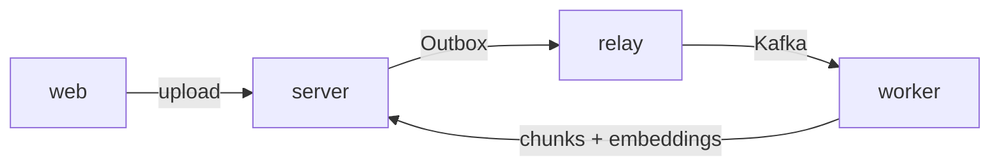
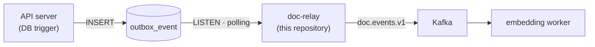
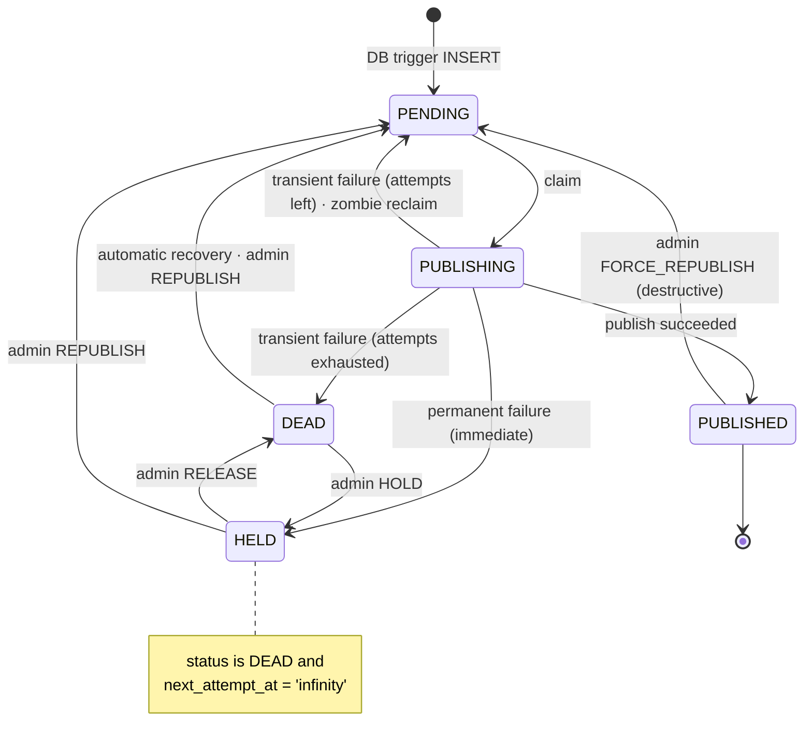

[한국어](README.md) / [English](README_EN.md)

# AI Document Management System — Outbox Relay Server


> 2026 Open Source Developer Contest · TmaxTibero corporate track

A relay server that moves indexing-request events to Kafka **without losing a single one**. It closes the gap where a transaction and a message publication diverge, and takes responsibility for the retries and reclaims that get every event out even when something dies in the middle.

---

## Overview

This system finds documents by meaning when you need them, and keeps the indexing in between off people's hands.

That is why the upload response does not wait for indexing. Instead, the API server records an indexing-request event in `outbox_event` **in the same atomic unit** as the transaction that stores the document, and this server moves that row to Kafka. A DB trigger creates the event row, so the application cannot forget to publish it, and if the store rolls back the event disappears with it. Even when publication fails the row stays in the table, so once the cause is gone the event eventually goes out.

<br>

The system spans four source repositories. An uploaded document becomes searchable through the path below.



| Repository | Role |
|---|---|
| [server](https://github.com/mash-up-kr/spr1n6-osscontest-server) | API server. Handles upload, permissions, and search, and records Outbox events |
| [relay](https://github.com/mash-up-kr/spr1n6-osscontest-relay) | Reads Outbox rows and publishes them to Kafka |
| [worker](https://github.com/mash-up-kr/spr1n6-osscontest-worker) | Splits documents into chunks, embeds them, and stores the result |
| [web](https://github.com/mash-up-kr/spr1n6-osscontest-web) | React SPA |

This repository is `relay`.

---

## Core features

### Publication that loses nothing

When the API server stores a document version, a DB trigger leaves an event row in `outbox_event`. This server watches that table, claims the rows whose turn has come, sends them to Kafka, and writes the result back as row state. It is **the relay of the Transactional Outbox pattern**, and events are delivered at least once.



`LISTEN` picks up new rows immediately, and periodic polling remains as a safety net in case a notification is lost. Run several instances and `SKIP LOCKED` still keeps any row from being claimed twice.

### Retries that recover on their own

When publication fails, the interval doubles with each attempt before retrying; once the ceiling is reached the row goes to `DEAD`. A row stuck in `PUBLISHING` because the relay died mid-publish is reclaimed after the lock timeout passes.

A row that reached `DEAD` by exhausting its attempts returns to `PENDING` on its own after the recovery delay and queues up again. A failure whose outcome will not change on retry, however — envelope assembly failure, record too large, topic authorization or name errors — goes straight to `DEAD` without retrying, with `next_attempt_at` set to `infinity` so automatic recovery skips it. Those rows stay put until a person returns them to automatic recovery with `RELEASE` or sends them again immediately with `REPUBLISH`, and they are counted separately as `held` in the admin view.



### A deliberately narrow boundary

The range the relay is allowed to touch was kept small on purpose.

- **It does not INSERT or DELETE.** Creating rows belongs to the DB trigger on the API server side, and every write the relay makes is an UPDATE. Even an admin republish reverts the existing row rather than creating a new one.
- **It does not consume from Kafka.** Subscribing belongs to the embedding worker, which absorbs duplicate publications by handling `eventId` idempotently.
- **It does not accept HTTP requests.** `server.port: -1` means the application port never opens at all; only the management port comes up.
- **It does not interpret the payload.** The raw JSONB is carried into the envelope as is.

### Observation and control for operators

Counts by status and the list of events publication gave up on are available through admin endpoints, and a single event can be picked out to republish or halt. Because automatic recovery resets the attempt count, an infinite cycle that the DB alone cannot reveal is still caught by a Prometheus counter. Details are in [Operations](#operations).

---

## Getting started

### Requirements

- JDK 21 or later
- Docker & Docker Compose

### Run

Brings up the relay, PostgreSQL, and Kafka together. It doubles as a smoke test that the image really attaches to a DB and a broker, and as the reference to copy from when moving the relay service into the team's integrated compose file.

```bash
docker compose up -d --build
curl localhost:9090/actuator/health
```

The `outbox_event` schema is normally created by the API server's migrations. This stack has no API server, so `demo/seed.sql` creates it instead — **do not carry that seed into the integrated stack.**

At startup `SchemaValidator` checks whether `outbox_event` has the expected shape and halts startup if it does not. In an integrated stack it is normal for the relay to die once if it comes up before the API server; leave it to `restart` and it attaches on its own once the schema exists.

### Endpoints

| Target | Address |
|---|---|
| Management port (actuator) | `http://localhost:9090` |
| PostgreSQL | `localhost:5432` |
| Kafka | `localhost:9092` |

### Shut down

```bash
docker compose down       # removes the containers only
docker compose down -v    # also drops the volumes so the schema is rebuilt
```

### Running locally (directly on the host)

Runs only the DB and Kafka in containers and the relay on the host. The `demo` profile carries both the connection details and the shortened timing values.

```bash
docker compose -f demo/docker-compose.yml up -d
docker compose -f demo/docker-compose.yml exec -T postgres \
  psql -U docrelay -d docrelay < demo/seed.sql

./gradlew bootRun --args='--spring.profiles.active=demo'
```

### Fault injection demo

`demo/run.sh` runs five scenarios — from a normal publication through killing the relay, stopping Kafka, and severing the LISTEN connection — and each time confirms with `demo/verify.sh <expected count>` that "rows inserted == unique `eventId` values that arrived in Kafka".

```bash
chmod +x demo/run.sh demo/verify.sh
./demo/run.sh
```

Details are in [Fault injection demo](demo/README_EN.md).

### Tests

Testcontainers starts PostgreSQL and Kafka, so Docker must be running.

```bash
./gradlew test
```

### Environment variables

These are the values needed when running in a container. Standard Spring keys are used as is, so no separate `.env.example` is kept.

| Variable | Required | Description |
|---|:--:|---|
| `SPRING_DATASOURCE_URL` | O | `jdbc:postgresql://<db-host>:5432/<db>` |
| `SPRING_DATASOURCE_USERNAME` | O | Account name |
| `SPRING_DATASOURCE_PASSWORD` | O | Password |
| `SPRING_KAFKA_BOOTSTRAP_SERVERS` | O | Broker address. Inside compose, use the container-to-container listener address |
| `RELAY_KAFKA_TOPIC` | X | Topic to publish to (default `doc.events.v1`) |
| `RELAY_KAFKA_PARTITIONS` | X | Topic partition count (default 3) |
| `RELAY_ADMIN_TOKEN` | X | Token for admin write actions. Authentication is off when empty |
| `RELAY_INSTANCE_ID` | X | Name recorded in `locked_by` (default `HOSTNAME`). Must differ across instances |
| `TZ` | X | Time zone. The whole stack is set to `Asia/Seoul` |

Connection details are never committed. The image carries none of them.

### Relay tuning values

Every duration and ceiling lives under `relay.*`; no number is hardcoded anywhere in the code. The defaults are production values.

| Key | Default | Description |
|---|---|---|
| `relay.drain.batch-size` | 100 | Maximum rows claimed in one cycle |
| `relay.polling.interval` | 10s | The last safety net that checks at this interval even if a notification is lost |
| `relay.backoff.base` / `max` | 10s / 5m | Doubles on each failure and never exceeds `max` |
| `relay.backoff.max-attempts` | 5 | Reaching this count sends the row to `DEAD` |
| `relay.dead.recovery-delay` | 10m | How long a `DEAD` row waits before becoming `PENDING` again |
| `relay.zombie.lock-timeout` | 5m | Threshold for reclaiming rows that were claimed but never finished |
| `relay.listener.channel` | `outbox_event` | Channel to `LISTEN` on. Matches the DB trigger's `pg_notify` |
| `relay.shutdown.drain-timeout` | 30s | Upper bound on waiting for an in-flight cycle during graceful shutdown |

At startup `BudgetValidator` checks the relationship between these values (one-cycle upper bound < zombie reclaim timeout) and halts startup if it does not hold. A container's `stop_grace_period` must be longer than `drain-timeout` — if it is shorter, `SIGKILL` arrives before the drain finishes.

---

## Profiles

The application code is identical under every profile. Only where the connection details come from and the timing values differ.

| Item | Default (no profile) | `demo` | `docker` |
|---|---|---|---|
| Purpose | Production · tests | Fault injection demo run on the host | Container execution |
| Connection details | Environment variables (Testcontainers for tests) | Written directly in `application-demo.yaml` | Environment variables |
| Management port bind | `127.0.0.1` | `127.0.0.1` | `0.0.0.0` |
| Backoff | 10s → 5m, 5 attempts | 2s → 20s, 5 attempts | Default |
| DEAD recovery delay | 10 minutes | 30 seconds | Default |
| Polling interval | 10 seconds | 3 seconds | Default |

The `docker` profile holds no connection details. This image ships without knowing which stack it will sit in, so the DB and Kafka addresses belong to whoever starts it, as environment variables. Baking `localhost` into the image would be useless — inside a container `localhost` is the container itself, so it would attach to nothing.

---

## Operations

Only the management port (9090) opens, and it binds to `127.0.0.1` by default. Reaching it requires being on the server or an SSH tunnel.

### Admin endpoints

```bash
# Counts by status
curl localhost:9090/actuator/outbox
# → { "pending": 12, "publishing": 3, "dead": 5, "held": 1 }

# Events publication gave up on
curl localhost:9090/actuator/outbox/dead

# Act on a single event (include "token" in the body if RELAY_ADMIN_TOKEN is set)
curl -X POST localhost:9090/actuator/outbox/{eventId} \
     -H 'Content-Type: application/json' -d '{"action":"HOLD"}'
```

| action | What it does | When |
|---|---|---|
| `REPUBLISH` | `PENDING` + attempt count 0 + immediate publish signal | The cause is fixed and you want it sent now |
| `HOLD` | `next_attempt_at = 'infinity'` | To stop a poison event that cycles forever |
| `RELEASE` | `next_attempt_at = now()` | To lift a `HOLD` |
| `FORCE_REPUBLISH` | Reverts a publication already finished (destructive) | When an incident on the consuming side needs redelivery |

### Metrics

Available at `/actuator/prometheus`.

| Kind | Metrics |
|---|---|
| Counters | `relay_publish_total{result}`, `relay_dead_transition_total`, `relay_dead_recovery_total`, `relay_zombie_reclaim_total`, `relay_listener_reconnect_total`, `relay_forced_republish_total`, `relay_stale_write_total`, `relay_mark_failure_total` |
| Gauges | `relay_outbox_pending`, `relay_outbox_dead`, `relay_outbox_held`, `relay_listener_connected` |
| Distributions | `relay_publish_latency_seconds{attempt}`, `relay_drain_batch_size` |

If `relay_dead_transition_total` climbs while `relay_publish_total{result="success"}` stands still, the same event is cycling endlessly between `DEAD` and `PENDING`. Because automatic recovery resets the attempt count to 0, **the DB alone cannot tell you which iteration you are on**, and this counter is the only window onto the cycle. Once you find the culprit, stop it with `HOLD`.

### Health checks

The health groups are split in two. A dead drain thread is a problem a restart fixes, so it goes in `liveness`; a severed LISTEN connection does not, because polling covers for it.

```bash
curl localhost:9090/actuator/health/liveness    # drainer
curl localhost:9090/actuator/health/readiness   # db, drainer
```

---

## Tech stack

| Area | Technology | Version |
|---|---|---|
| Language | Kotlin | 2.3.21 |
| Runtime | Java (JVM) | 21 LTS |
| Framework | Spring Boot | 4.1.0 |
| DB access | Spring Data JDBC (JdbcClient) | 4.1.x |
| Messaging | Spring for Apache Kafka | 4.1.0 |
| Broker | Apache Kafka | 4.0.0 |
| Build | Gradle (Kotlin DSL) | 9.5.1 |
| DB (dev) | Tmax OpenSQL | v3.0 |
| DB (local) | PostgreSQL | 17 |
| Driver | PostgreSQL JDBC | 42.7.x |
| Observability | Micrometer / Prometheus | 1.17.x |
| Test | Testcontainers | 2.0.x |

The DB is the same one the API server sees: Tmax OpenSQL v3.0 in the dev environment, PostgreSQL 17 for the local and demo stacks. SQL is written directly with `JdbcClient` rather than JPA, because handling contention across instances with `SKIP LOCKED` and hitting the partial indexes exactly is the heart of this server — which means the generated SQL has to stay under our control.

---

## Documentation

| Document | Contents |
|---|---|
| [Architecture](docs/ARCHITECTURE_EN.md) | Relay responsibilities and boundaries, drain pipeline, failure handling and recovery paths, design decisions |
| [Fault injection demo](demo/README_EN.md) | How the five scenarios are built and how zero loss is confirmed |
| [Code conventions](docs/CODE_CONVENTIONS_EN.md) | Rules for comments, readability, structure, failure handling, tests, and commits |

---

## License

This project is licensed under the MIT License. See [LICENSE](LICENSE) for details.

### Open source used

| Project | License |
|---|---|
| Spring Boot | Apache-2.0 |
| Kotlin | Apache-2.0 |
| Apache Kafka | Apache-2.0 |
| PostgreSQL | PostgreSQL License |
| PostgreSQL JDBC Driver | BSD-2-Clause |
| Micrometer | Apache-2.0 |
| Testcontainers | MIT |

Tmax OpenSQL is a commercial TmaxTibero product and is not included in this repository.
