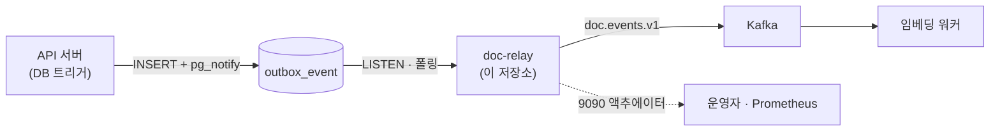
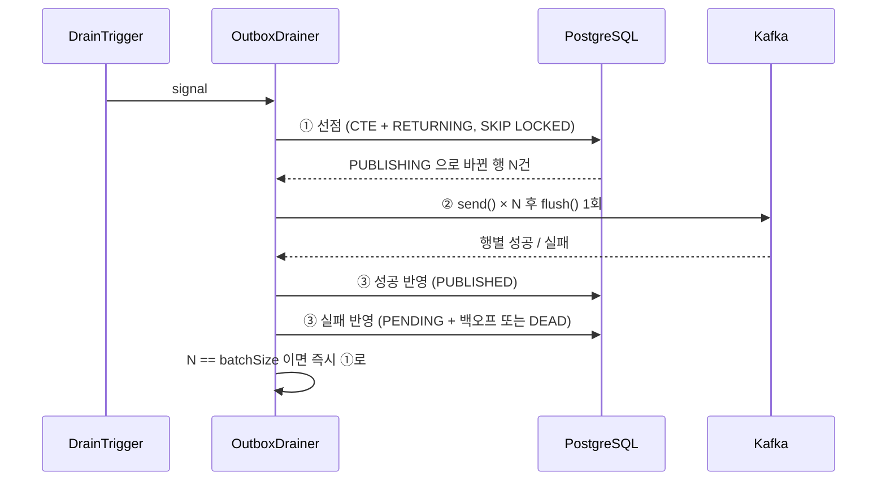
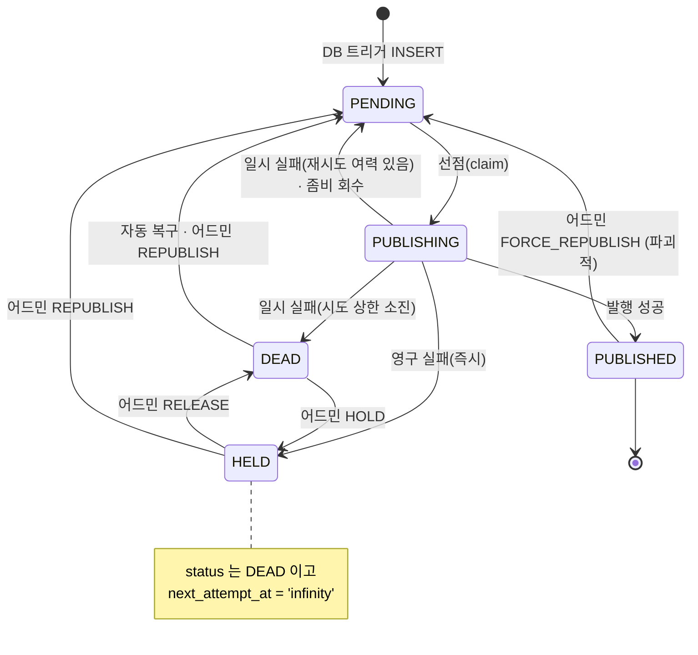

# Relay Architecture

이 문서는 Outbox 릴레이 서버의 전체 구조와 구성 요소 간 책임, 신호와 발행 흐름, 트랜잭션 경계 및 주요 설계 결정을 설명합니다.

## 1. 문서 목적과 범위

이 문서는 README보다 한 단계 깊은 다음 내용을 다룹니다.

- 릴레이의 책임과 외부 시스템 경계
- 설계 목표와 기술 제약
- 내부 building block과 의존 방향
- 신호 수신부터 Kafka 발행까지의 런타임 흐름
- 릴레이가 사용하는 데이터와 트랜잭션 경계
- 주요 architecture decision, 품질 요구사항과 구조적 한계

`outbox_event` 테이블의 전체 정의와 컬럼별 쓰기 소유권은 API 서버 저장소의 [데이터베이스 스키마](https://github.com/mash-up-kr/spr1n6-osscontest-server/blob/main/docs/SCHEMA.md)가 소유합니다. 이 문서에서는 릴레이가 기대하는 부분까지만 설명합니다.

### 1.1 구현 기준

| 구분 | 현재 구현 |
|---|---|
| 프로젝트 구조 | 단일 Gradle 모듈 |
| 런타임 | Java 21 |
| 언어 | Kotlin 2.3.21 |
| 애플리케이션 | Spring Boot 4.1.0 |
| DB 접근 | Spring Data JDBC `JdbcClient`, PostgreSQL JDBC 42.7.11 |
| 메시징 | Spring for Apache Kafka 4.1.0, Apache Kafka 4.0.0 broker |
| 관측 | Micrometer 1.17.0, Prometheus registry |
| 테스트 | Testcontainers 2.0.5 (PostgreSQL, Kafka) |
| HTTP | 없음. 애플리케이션 포트를 닫고 Actuator 관리 포트만 사용 |

## 2. Architecture Goals

| 목표 | 필요한 이유 | 현재 설계의 대응 |
|---|---|---|
| 이벤트 유실 없는 발행 | 문서를 저장했는데 인덱싱 요청이 나가지 않으면 사용자는 올린 문서를 검색할 수 없고, 아무도 그 사실을 모릅니다. | 발행할 것을 문서 저장 트랜잭션과 같은 원자 단위로 `outbox_event` 에 남기고, 릴레이는 그 테이블만 진실의 원천으로 삼습니다. 발행에 실패해도 행이 남아 있으므로 원인이 사라지면 다시 나갑니다. |
| 느린 Kafka가 DB를 인질로 잡지 않을 것 | 행에 락을 쥔 채 브로커 응답을 기다리면 Kafka가 느려진 만큼 DB 락이 길어지고, 회수·집계 쿼리까지 함께 밀립니다. | 선점을 짧은 트랜잭션 하나로 끝내고 락을 놓은 뒤 네트워크로 나갑니다. 사이클을 선점·발행·반영 세 단계로 나눈 것이 이 목표에서 나왔습니다. |
| 알림 경로가 죽어도 계속 동작할 것 | `pg_notify` 는 유실될 수 있고 LISTEN 커넥션은 페일오버 때 가장 먼저 끊깁니다. | 알림·폴링·어드민 세 경로가 모두 "깨워라" 신호만 보내고, 무엇을 보낼지는 항상 DB에 다시 묻습니다. 알림 경로가 통째로 죽어도 폴링 주기만큼 느려질 뿐 데이터를 잃지 않습니다. |
| 실패한 발행의 자체 복구 | 브로커 재시작이나 일시적 네트워크 장애 때마다 사람이 개입해야 하면 운영이 성립하지 않습니다. | 지수 백오프로 재시도하고, 시도 상한을 넘긴 행도 복구 지연 후 다시 대기열로 돌아옵니다. 발행 도중 죽은 인스턴스가 남긴 행은 잠금 타임아웃으로 회수합니다. |
| 여러 인스턴스의 동시 동작 | 릴레이가 단일 장애점이 되면 안 되고, 처리량을 늘릴 여지도 필요합니다. | 선점 쿼리가 `FOR UPDATE SKIP LOCKED` 로 경합을 처리하고, 결과 쓰기는 `locked_by` · `locked_at` 로 소유권을 확인합니다. 인스턴스를 늘리는 데 코드 변경이 필요 없습니다. |
| 조용한 오작동의 차단 | 스키마가 어긋나거나 설정 관계가 깨지면 릴레이는 "보낼 게 없다"고 판단해 정상처럼 보이면서 이벤트를 쌓기만 합니다. | 기동 시 스키마와 타임아웃 예산을 검증하고, 어긋나면 기동을 중단합니다. 드레인 스레드 상태는 헬스체크에 연결합니다. |

## 3. Architecture Constraints

### 3.1 소유권과 경계

- `outbox_event` 의 스키마와 마이그레이션은 API 서버 저장소가 소유합니다. 이 저장소는 Flyway를 포함하지 않고 Testcontainers용 픽스처 SQL만 둡니다. 픽스처를 운영 마이그레이션과 맞추는 책임은 이쪽에 있습니다.
- 행 생성은 DB 트리거의 몫입니다. 릴레이는 `outbox_event` 에 INSERT도 DELETE도 하지 않고, 모든 쓰기가 UPDATE입니다.
- 릴레이는 다른 파트가 소유한 테이블을 읽지 않습니다. `indexing_job` 을 비롯한 나머지 테이블에 접근하지 않습니다.

### 3.2 데이터와 transaction

- 네트워크 IO는 트랜잭션 밖에서만 일어납니다.
- 모든 SQL은 `OutboxRepository` 한 곳에 모으고, 다른 클래스는 SQL 문자열을 갖지 않습니다.
- JPA 엔티티를 두지 않고 `JdbcClient` 로 SQL을 직접 씁니다. `SKIP LOCKED` 와 부분 인덱스를 정확히 타는 것이 이 서버의 핵심이라 생성되는 SQL을 통제해야 합니다.
- 모든 시각 컬럼이 `TIMESTAMPTZ` 이므로 애플리케이션 타입은 `Instant` 로 통일합니다.

### 3.3 외부 시스템

- Kafka 전달 보장은 at-least-once입니다. exactly-once를 추구하지 않고, 중복은 받는 쪽이 흡수합니다.
- Kafka 트랜잭션은 쓰지 않고 멱등 프로듀서(`acks=all`, `enable.idempotence=true`)만 켭니다.
- 모든 타임아웃·주기·상한은 `relay.*` 프로퍼티로 빼고 코드에 숫자를 박지 않습니다.

## 4. System Context & Scope



### 4.1 릴레이의 책임

| 하는 일 | 설명 |
|---|---|
| 선점 | `PENDING` 이고 발행 시각이 된 행을 배치 크기만큼 `PUBLISHING` 으로 바꾸며 가져옵니다 |
| 발행 | 행을 봉투로 조립해 Kafka 토픽으로 배치 발행합니다 |
| 결과 반영 | 성공은 `PUBLISHED`, 실패는 백오프를 얹은 `PENDING` 또는 `DEAD` 로 기록합니다 |
| 회수 | 발행 도중 릴레이가 죽어 `PUBLISHING` 에 갇힌 행을 `PENDING` 으로 되돌립니다 |
| 복구 | 복구 시각이 지난 `DEAD` 행을 `PENDING` 으로 되살립니다 |
| 관측과 조작 | 상태별 건수, `DEAD` 목록, 재발행·정지 액션, Prometheus 지표를 관리 포트로 노출합니다 |

### 4.2 릴레이가 하지 않는 일

경계를 좁게 유지하는 것이 이 설계의 전제입니다.

| 항목 | 담당 |
|---|---|
| 워커가 멈춘 Job 회수 | 임베딩 워커 (Kafka 오프셋 재전달) |
| 재인덱싱 (새 이벤트 생성) | API 서버 (새 outbox 행 INSERT) |
| 순서 역전 판정과 펜싱 | 임베딩 워커 |
| 중복 처리 흡수 | 임베딩 워커 (`source_event_id` 유니크 제약) |
| `PUBLISHED` 행의 보존 정책 | 미정. 릴레이는 행을 지우지 않습니다 |

### 4.3 요청을 받지 않는 서버

HTTP 엔드포인트를 제공하지 않습니다. 애플리케이션 포트를 닫고(`server.port: -1`) 관리 포트만 엽니다. 어드민 조작도 `@RestController` 가 아니라 Actuator 엔드포인트로 만듭니다.

Actuator의 HTTP 노출이 서블릿 컨테이너 위에 얹히므로 `spring-boot-starter-web` 의존성 자체는 들어옵니다. 요청을 받지 않는다는 보장은 의존성 부재가 아니라 위 두 가지와, 컨트롤러 빈이 하나라도 있으면 실패하는 테스트(`NoControllersTest`)로 강제합니다.

## 5. Solution Strategy

| 문제 | 선택 | 근거 |
|---|---|---|
| 트랜잭션과 메시지 발행의 원자성 | Transactional Outbox의 릴레이 역할만 담당 | DB와 Kafka를 한 트랜잭션으로 묶을 수 없으므로, 같은 DB 안에 발행 의도를 남기고 그것을 옮기는 쪽으로 문제를 바꿉니다 |
| 발행 지연 | `LISTEN/NOTIFY` 를 주 경로로, 주기 폴링을 안전망으로 | 알림으로 즉시성을 얻고, 알림 유실에는 폴링이 상한을 보장합니다 |
| 인스턴스 간 경합 | `FOR UPDATE SKIP LOCKED` 단일 문장 선점 | 애플리케이션 락이나 리더 선출 없이 여러 대를 띄울 수 있습니다 |
| 배치 처리량 | `send()` 전량 후 `flush()` 1회 | 왕복 수를 줄이면서 행별 성공·실패 판정은 그대로 유지합니다 |
| 재시도 폭주 | SQL 식으로 계산하는 지수 백오프 | 행마다 시도 횟수가 다르므로 애플리케이션에서 단일 값을 계산하면 배치 UPDATE로 접을 수 없습니다 |
| 설정 오류의 조용한 전파 | 기동 시 스키마·예산 검증 | 잘못된 설정으로 도는 것보다 뜨지 않는 편이 낫습니다 |

## 6. Building Block View

### 6.1 논리 구조

```
doc-relay
├─ 신호 경로
│   ├─ PgNotificationListener   전용 커넥션으로 LISTEN. 재연결 + 재연결 후 신호 1회
│   ├─ PollingScheduler         주기 안전망
│   └─ DrainTrigger             신호 합치기 + 드레인 스레드 1개
│
├─ 발행
│   ├─ OutboxDrainer            사이클: 선점 → 발행 → 반영 → 재사이클 판단
│   ├─ OutboxRepository         모든 SQL. 선점 / 반영 / 회수 / 복구 / 집계
│   ├─ EnvelopeAssembler        행 → 봉투 (payload 무파싱 통과)
│   ├─ KafkaPublisher           배치 send + flush + 성공/실패 분류
│   ├─ KafkaProducerConfig      acks=all, 멱등 프로듀서
│   ├─ FailureClassifier        영구 실패 / 일시 실패 판정
│   └─ BackoffPolicy            min(base × 2^(n-1), max)
│
├─ 복구
│   ├─ ZombieRecoveryScheduler  PUBLISHING + 락 만료 → PENDING
│   └─ DeadRecoveryScheduler    DEAD + 시각 도래 → PENDING
│
├─ 수명주기
│   ├─ SchemaValidator          기동 시 스키마 검증
│   ├─ BudgetValidator          기동 시 타임아웃 예산 검증
│   └─ DrainerHealthIndicator   드레인 스레드 상태
│
└─ 관측 / 조작
    ├─ RelayMetrics             Micrometer 계측 + 게이지 갱신
    └─ OutboxEndpoint           조회 / 재발행 / 정지 / 해제
```

### 6.2 주요 building block

| 구성 요소 | 책임 | 유의점 |
|---|---|---|
| `DrainTrigger` | 세 신호 경로를 하나로 합치고 드레인 스레드를 소유합니다 | 용량 1짜리 큐로 신호를 접습니다. 드레인 사이클은 항상 한 번에 하나만 돕니다 |
| `OutboxDrainer` | 한 사이클의 순서를 정하고 결과를 반영합니다 | 선점 건수가 배치 크기와 같으면 백로그가 남았다는 뜻이므로 즉시 다음 사이클을 돕니다 |
| `OutboxRepository` | 선점·반영·회수·복구·집계 SQL 전부 | 이 저장소의 SQL이 모두 여기 있습니다. 부분 인덱스와 `SKIP LOCKED` 를 정확히 타야 합니다 |
| `EnvelopeAssembler` | 행을 Kafka 메시지 본문으로 조립합니다 | `payload` 를 해석하지 않고, `eventType` 으로 분기하지 않으며, 최상위 필드를 컬럼에서만 채웁니다 |
| `KafkaPublisher` | 배치 발행과 행별 성공·실패 분류 | 봉투 조립이 실패한 행만 실패 목록으로 보내고 나머지는 그대로 발행합니다 |
| `FailureClassifier` | 재시도해도 결과가 달라지지 않는 실패를 가려냅니다 | 확신이 없으면 일시 실패로 둡니다 |

## 7. Runtime View

### 7.1 신호 경로

새 이벤트가 생겼다는 것을 아는 방법이 셋이고, 전부 한 곳으로 모입니다.

```
  PgNotificationListener ─┐   트리거의 pg_notify 를 받고
  PollingScheduler ───────┼─→ 주기가 돌아왔고        ─→ DrainTrigger.signal() ─→ 드레인 스레드 1개
  OutboxEndpoint ─────────┘   사람이 REPUBLISH 를 눌렀고
```

**셋 다 "깨워라"만 보냅니다.** 무엇을 발행할지는 셋 중 누구도 정하지 않습니다. 어느 경로로 깨어났든 드레인 사이클은 똑같이 DB에 `PENDING` 이고 시각이 된 행을 다시 묻습니다. 그래서 경로를 하나 더 붙이거나 하나가 죽어도 발행 로직은 바뀌지 않습니다.

**DB 알림** — 커넥션 풀이 아니라 전용 커넥션 하나를 열어 `LISTEN outbox_event` 를 겁니다. 알림에 실려 온 이벤트 UUID는 조회 키로 쓰지 않습니다. 알림을 진실의 원천으로 삼으면 유실된 알림의 이벤트는 영원히 발행되지 않기 때문입니다. 재연결 직후에는 무조건 신호를 한 번 쏴서 끊긴 동안 유실된 알림을 보상합니다. LISTEN 커넥션은 알림을 기다리는 동안 유휴로 보이므로, DB의 `idle_session_timeout` 에 끊기지 않도록 keepalive 주기를 따로 둡니다.

**폴링** — 고정 주기로 신호만 쏩니다. 스케줄러 자신은 DB를 조회하지 않으므로 DB가 느리거나 죽어 있어도 이 경로는 막히지 않습니다.

**신호 합치기** — `DrainTrigger` 는 "다음 사이클이 필요하다"는 사실 하나만 들고 있습니다. 용량 1짜리 큐가 그 사실을 담으므로 신호가 1000개 와도 추가 드레인은 최대 1회입니다. 큐가 차 있으면 새 신호는 조용히 버려지는데, 담긴 것과 버려진 것이 같은 사실이라 잃는 정보가 없습니다. 이벤트 1000건이 쌓여도 스레드는 한 번 깨어나고, 대신 사이클 안에서 백로그가 빌 때까지 반복합니다.

### 7.2 드레인 사이클

한 사이클은 세 단계이고, 네트워크 IO는 트랜잭션 밖에서만 일어납니다.



**① 선점** — 고르기·표시하기·가져오기가 한 문장 안에서 끝납니다. `ORDER BY next_attempt_at, id` 가 `idx_outbox_pending` 의 컬럼 순서와 같아 정렬이 붙지 않고, `WHERE` · `ORDER BY` · `LIMIT` 를 인덱스 하나가 받습니다. SELECT와 UPDATE를 나누면 그 사이에 락을 놓치거나 반대로 락을 쥔 채 밖으로 나가는 문이 열립니다. DB 왕복은 1회입니다.

**② 발행** — 배치 전체를 프로듀서 버퍼에 밀어 넣고 `flush()` 한 번으로 응답을 받습니다. `send()` 는 네트워크로 나가지 않고 즉시 반환하며, `flush()` 가 쌓인 것을 파티션별로 묶어 보냅니다. 왕복을 줄인 것이지 확인을 건너뛴 것이 아니어서, `flush()` 후 행마다 `Future` 를 열어 성공과 실패를 가릅니다. 배치 안에서 일부만 실패하는 것이 정상입니다.

**③ 반영** — 성공한 건은 한 문장으로 내리고, 실패한 건은 **에러 메시지를 키로 묶어** 묶음마다 UPDATE 한 번씩 날립니다. 같은 메시지를 쓸 행들은 `last_error_message` 가 같아 한 문장에 들어가기 때문입니다. 브로커가 통째로 죽으면 배치 전체가 같은 예외로 실패하므로 묶음이 하나뿐이고, 최악의 장애가 오히려 가장 싸게 처리됩니다. 정상 경로의 DB 왕복은 사이클당 3회입니다.

### 7.3 메시지 계약

```
Topic     doc.events.v1        (partitions = 3)
Key       document_id (String)  ← 문서 단위 순서 보장. 변경 금지
Headers   eventId / traceId / schemaVersion
Producer  acks=all, enable.idempotence=true
전달 보장  at-least-once
```

봉투는 컬럼에서 복원한 최상위 필드와 통과시킨 `payload` 로 이루어집니다.

```json
{
  "eventId": "...",
  "tenantId": 1,
  "documentId": 42,
  "documentVersionId": 137,
  "eventType": "INDEXING_REQUESTED",
  "schemaVersion": 1,
  "occurredAt": "2026-08-13T09:14:22Z",
  "payload": { }
}
```

세 원칙을 지킵니다. **`payload` 를 파싱하지 않습니다** — JSONB 원문을 JSON 노드로 그대로 꽂으므로 파트너가 필드를 추가해도 릴레이는 바뀌지 않습니다. **`eventType` 으로 분기하지 않습니다** — 컬럼 값을 복사만 하므로 새 이벤트 종류가 추가돼도 손댈 곳이 없습니다. **최상위 필드는 컬럼에서 복원합니다** — payload 안의 값을 끌어올리지 않습니다. `documentVersionId` 는 `DOCUMENT_DELETED` 에서 `NULL` 이 될 수 있고, 필드를 빼지 않고 `null` 로 넣습니다. 필드의 유무가 이벤트 종류에 따라 달라지면 받는 쪽이 종류별로 분기해야 하기 때문입니다.

`event_schema_version` 과 `trace_id` 는 릴레이가 의미를 해석하지 않고 옮기기만 하는 두 컬럼입니다. `schemaVersion` 은 봉투 필드와 헤더로, `trace_id` 는 Kafka 헤더와 로그 MDC로 갑니다. `trace_id` 가 필요한 이유는 이벤트가 DB 트리거로 태어나기 때문입니다. 업로드 요청과 Kafka 메시지 사이에 트랜잭션 경계와 비동기 발행이 끼어 있어서, 이 값이 없으면 메시지가 어느 사용자 요청에서 시작됐는지 이어 볼 방법이 없습니다.

## 8. Data & State Model

### 8.1 릴레이가 기대하는 형태

`outbox_event` 의 전체 정의는 API 서버 저장소가 소유합니다. 릴레이가 의존하는 부분은 다음과 같습니다.

| 대상 | 릴레이의 의존 |
|---|---|
| 컬럼 | `id`, `tenant_id`, `document_id`, `document_version_id`, `event_type`, `event_schema_version`, `payload`, `trace_id`, `status`, `publish_attempt_count`, `next_attempt_at`, `locked_by`, `locked_at`, `published_at`, `last_error_message`, `created_at` |
| 제약 | `status` 가 `DEAD` 를 허용할 것, `next_attempt_at` 이 `NOT NULL` 일 것 |
| 인덱스 | `idx_outbox_pending (next_attempt_at, id) WHERE status = 'PENDING'`, `idx_outbox_stuck (locked_at) WHERE status = 'PUBLISHING'` |
| 알림 | 트리거가 `pg_notify('outbox_event', <id>)` 를 쏠 것 |

`idx_outbox_pending` 의 컬럼 순서가 선점 쿼리의 `ORDER BY` 와 일치해야 합니다. 일치하지 않으면 매 사이클 정렬이 붙습니다.

### 8.2 릴레이가 쓰는 컬럼

| 컬럼 | 권한 |
|---|---|
| `status` · `locked_by` · `locked_at` · `next_attempt_at` · `publish_attempt_count` · `published_at` · `last_error_message` | UPDATE |
| `payload` · `trace_id` · `event_schema_version` · 나머지 | 읽기만 |

`retry_of_event_id` 는 API 서버가 재인덱싱 요청 시 기록하는 컬럼으로, 릴레이는 읽지도 발행하지도 않습니다.

### 8.3 상태 전이



`HELD` 는 별도의 상태값이 아닙니다. `status` 는 여전히 `DEAD` 이고 `next_attempt_at` 이 `'infinity'` 인 행을 가리킵니다. 자동 복구 쿼리가 `next_attempt_at <= now()` 로 대상을 고르므로 이 행들은 잡히지 않습니다. 상태를 하나 더 만들지 않은 것은 파트너가 소유한 `ck_outbox_status` 제약을 건드리지 않기 위해서입니다.

멈춰 둔 행을 따로 세는 이유는, 상태값만으로는 저절로 회복될 것과 사람이 손대야 할 것이 구분되지 않기 때문입니다. 어드민 집계는 둘을 `dead` 와 `held` 로 나눠 돌려줍니다.

### 8.4 중복 발행이 발생하는 지점

Kafka ack를 받고 결과 반영을 커밋하기 전에 프로세스가 죽으면, 그 행은 `PUBLISHING` 으로 남았다가 좀비 회수를 거쳐 다시 발행됩니다.

이것은 at-least-once 계약상 정상이며 워커 멱등성(`source_event_id` 유니크, 청크 UPSERT)이 흡수합니다. 없애려면 Kafka 트랜잭션과 DB 트랜잭션을 묶어야 하는데 그럴 가치가 없습니다. 이 계약은 버그를 잡는 테스트가 아니라 계약을 문서화하는 테스트로 못 박아 둡니다.

## 9. Cross-cutting Concepts

### 9.1 실패 분류와 백오프

발행 실패는 영구와 일시로 나뉩니다. 다시 시도해도 결과가 달라지지 않는 실패만 영구로 분류하고, 확신이 없으면 일시로 둡니다. 잘못 재시도하면 낭비지만 잘못 영구로 판정하면 멈춰선 안 될 이벤트가 멈추기 때문입니다.

| 분류 | 대상 | 처리 |
|---|---|---|
| 영구 | 봉투 조립 실패, `RecordTooLargeException`, `TopicAuthorizationException`, `InvalidTopicException` | 재시도 없이 `DEAD` + `next_attempt_at = 'infinity'` |
| 일시 | 그 밖의 모든 예외 | 백오프를 얹은 `PENDING`, 시도 상한에 닿으면 복구 시각을 얹은 `DEAD` |

예외는 자신에서 시작해 cause 체인을 끝까지 훑어 판정합니다. 몇 겹으로 싸여 있는지 세지 않는 것이 요점입니다. 포장 깊이는 라이브러리 사정이라 같은 실패도 경로에 따라 깊이가 다릅니다 — 프로듀서가 보내기 전에 걸러낸 실패는 한 겹이지만, 브로커가 거절해 콜백으로 오는 실패는 두 겹이 덧씌워집니다. 깊이를 고정하면 그 사정이 바뀌는 순간 조용히 어긋납니다.

백오프는 애플리케이션이 아니라 SQL 식으로 계산합니다. 행마다 `publish_attempt_count` 가 다르므로 애플리케이션에서 계산한 단일 값을 넘기면 배치 UPDATE로 접을 수 없습니다.

```sql
next_attempt_at = now() + LEAST(:baseSeconds * POWER(2, publish_attempt_count), :maxSeconds)
                          * INTERVAL '1 second'
```

### 9.2 복구 경로

**좀비 회수** — `PUBLISHING` 이고 `locked_at` 이 잠금 타임아웃을 넘긴 행을 `PENDING` 으로 되돌립니다. 시도 횟수를 올리고 백오프를 얹되, 한도를 넘겼어도 `DEAD` 로 내리지 않고 항상 `PENDING` 입니다. 회수는 이벤트 자체의 실패가 아니라 인스턴스의 죽음이 원인이기 때문입니다.

**DEAD 자동 복구** — `DEAD` 이고 `next_attempt_at` 이 지난 행을 `PENDING` 으로 되살리며 시도 횟수를 `0` 으로 초기화합니다. `'infinity'` 인 행은 조건에 걸리지 않아 자동으로 살아나지 않습니다.

### 9.3 소유권 확인

회수 장치가 있는 시스템에서는 사이클 도중에 행의 소유권이 넘어갈 수 있습니다. 결과 반영 UPDATE는 항상 `status`, `locked_by`, `locked_at` 세 조건을 함께 확인합니다.

```sql
WHERE id IN (:ids) AND status = 'PUBLISHING'
  AND locked_by = :instanceId AND locked_at = :claimedAt
```

이 확인이 없으면, 느린 사이클이 회수당한 뒤 뒤늦게 돌아와 이미 다른 인스턴스가 선점한 행의 상태를 덮어씁니다. 조건에 걸려 갱신되지 않은 행은 `relay_stale_write_total` 로 셉니다.

### 9.4 시간 예산

한 사이클의 최대 소요 시간이 좀비 회수 타임아웃보다 짧아야 합니다. 이 관계가 깨지면 회수가 아직 발행 중인 배치를 뺏어 가고, 소유권 확인이 막으려는 경합이 실제로 벌어집니다.

```
kafka.producer.max-block + kafka.producer.delivery-timeout + DB 왕복 여유(10초)
    < zombie.lock-timeout
```

기동 시 `BudgetValidator` 가 이 관계를 검증하고 어긋나면 기동을 중단합니다. 설정을 잘못 바꾸면 조용히 깨지는 종류의 관계이기 때문입니다.

### 9.5 Observability

| 종류 | 지표 |
|---|---|
| 카운터 | `relay_publish_total{result}`, `relay_dead_transition_total`, `relay_dead_recovery_total`, `relay_zombie_reclaim_total`, `relay_listener_reconnect_total`, `relay_forced_republish_total`, `relay_stale_write_total`, `relay_mark_failure_total` |
| 게이지 | `relay_outbox_pending`, `relay_outbox_dead`, `relay_outbox_held`, `relay_listener_connected` |
| 분포 | `relay_publish_latency_seconds{attempt}`, `relay_drain_batch_size` |

`relay_dead_transition_total` 은 자동 복구가 시도 횟수를 `0` 으로 리셋하기 때문에 필요합니다. DB만 봐서는 같은 이벤트가 `DEAD ↔ PENDING` 을 몇 번째 순환하는지 알 수 없고, 이 카운터가 순환을 관측하는 유일한 창입니다.

헬스 그룹은 두 가지로 나눕니다. 드레인 스레드가 죽으면 재시작으로 낫는 문제라 `liveness` 에 넣고, LISTEN 커넥션이 끊긴 것은 폴링이 대신 동작하므로 넣지 않습니다.

### 9.6 기동과 종료

기동 시 `SchemaValidator` 가 `information_schema` · `pg_catalog` 조회로 스키마를 검증합니다.

| 검증 | 불일치 시 |
|---|---|
| 필수 컬럼 존재 | 기동 중단 |
| `next_attempt_at` 이 `NOT NULL` 인가 | 기동 중단 |
| `status` 제약이 `DEAD` 를 허용하는가 | 기동 중단 |
| 인덱스 두 개 존재 | 경고 로그 |

`next_attempt_at` 이 nullable인 DB에 붙으면 선점 쿼리가 조용히 0건을 반환하고, 릴레이는 "발행할 게 없다"고 판단해 정상처럼 보입니다. 이벤트는 계속 쌓이는데 아무도 모르는 상태가 되므로, 실패는 시끄러운 쪽이 낫습니다. 인덱스는 없어도 결과가 맞고 느려지기만 하므로 경고만 남깁니다.

종료 시에는 진행 중인 사이클이 끝날 때까지 상한만큼 기다립니다. 컨테이너의 `stop_grace_period` 는 이 값보다 길어야 하고, 짧으면 드레인이 끝나기 전에 `SIGKILL` 이 날아갑니다.

## 10. Architecture Decisions

| 결정 | 대안 | 선택 이유 |
|---|---|---|
| 선점·발행·반영 3단계 분리 | 한 트랜잭션 안에서 선점부터 발행까지 | 락을 쥔 채 네트워크로 나가면 느린 쪽이 빠른 쪽을 인질로 잡습니다 |
| 알림을 신호로만 사용 | 알림의 이벤트 ID로 대상 조회 | 알림을 진실의 원천으로 삼으면 유실된 알림의 이벤트가 영원히 발행되지 않습니다 |
| `JdbcClient` 직접 SQL | JPA / Spring Data 리포지터리 | `SKIP LOCKED` 와 부분 인덱스를 정확히 타는 것이 핵심이라 생성 SQL을 통제해야 합니다 |
| `HELD` 를 별도 상태값으로 두지 않음 | `ck_outbox_status` 에 상태 추가 | 파트너가 소유한 제약을 건드리지 않고 `next_attempt_at = 'infinity'` 로 같은 효과를 냅니다 |
| Actuator 엔드포인트로 어드민 제공 | `@RestController` | 애플리케이션 포트를 닫아 둔 채 관리 포트로만 조작을 노출합니다 |
| 멱등 프로듀서만 사용 | Kafka 트랜잭션 | exactly-once 비용을 치르지 않고 at-least-once를 계약으로 못 박습니다 |
| 어드민도 UPDATE만 수행 | 재발행 시 새 행 INSERT | 새 행을 만드는 재발행은 재인덱싱의 몫이고 그 주체는 API 서버입니다 |

## 11. Quality Requirements

| 품질 속성 | 시나리오 | 대응 |
|---|---|---|
| 무결성 | 릴레이가 발행 도중 강제 종료된다 | 좀비 회수가 `PUBLISHING` 행을 되돌리고, 중복 발행은 워커 멱등성이 흡수합니다 |
| 가용성 | LISTEN 커넥션이 끊긴다 | 폴링 안전망이 대신 동작하고, 재연결 후 신호 1회로 유실된 알림을 보상합니다 |
| 가용성 | Kafka 브로커가 장기간 중단된다 | 백오프로 재시도하고 시도 상한을 넘긴 행도 복구 지연 후 되살아납니다 |
| 확장성 | 릴레이를 여러 대 띄운다 | `SKIP LOCKED` 선점과 소유권 확인으로 코드 변경 없이 동작합니다 |
| 운영성 | 특정 이벤트가 무한 순환한다 | `relay_dead_transition_total` 로 관측하고 `HOLD` 로 멈춥니다 |
| 안전성 | 관리 포트가 외부에 노출된다 | 기본 바인드가 `127.0.0.1` 이고, 쓰기 액션은 토큰으로 보호합니다 |

## 12. Architecture Risks & Limitations

| 항목 | 내용 |
|---|---|
| `PUBLISHED` 행의 무한 증식 | 릴레이는 행을 지우지 않고 보존 정책도 없습니다. 테이블이 자라면 부분 인덱스가 없는 `DEAD` · `held` 집계가 그만큼 비싸집니다. 인덱스를 붙여도 증식 자체는 멈추지 않으므로 두 문제는 별개입니다 |
| `DEAD` 조회의 Seq Scan | `DEAD` 에 맞는 부분 인덱스가 없어 집계가 테이블 전체를 읽습니다. `DEAD` 행이 적다는 전제로 감수하고 있습니다 |
| 스키마 검증의 이름 의존 | 제약과 인덱스를 이름으로 조회하므로, 파트너가 이름만 바꿔도 검증이 어긋납니다 |
| 단일 드레인 스레드 | 인스턴스당 사이클은 하나만 돕니다. 처리량은 배치 크기와 인스턴스 수로 늘립니다 |
| 봉투 형태의 확정 | 최상위 필드 구성은 워커 쪽과 합의된 형태이며, 바뀌면 `EnvelopeAssembler` 와 그 테스트를 함께 고칩니다 |

## 13. 설계 원칙

1. **락을 쥔 채 네트워크로 나가지 않습니다.** 느린 쪽이 빠른 쪽을 인질로 잡지 못하게 합니다.
2. **신호는 깨우기만 합니다. 무엇을 보낼지는 항상 DB에 다시 묻습니다.** 그래서 알림 경로가 통째로 죽어도 데이터를 잃지 않고 느려질 뿐입니다.
3. **종착 상태를 두지 않습니다. 대신 사람이 멈출 수 있게 합니다.** 그 대가는 새 상태를 만들지 말고 기존 정지 스위치로 갚습니다.
4. **소유권은 사이클 도중에 넘어갈 수 있다고 가정합니다.** 회수 장치가 있는 시스템에서 결과 쓰기는 항상 소유권을 확인해야 합니다.
5. **재시도 예산은 회수 타임아웃 안에 들어가야 합니다.** 넘기는 순간 회수가 정상 동작을 가로챕니다.
6. **릴레이는 `outbox_event` 에 INSERT도 DELETE도 하지 않습니다.** 모든 쓰기가 UPDATE이고 어드민 경로도 예외가 아닙니다.
7. **다른 팀의 테이블을 읽지 않습니다.** 남의 테이블의 의미를 알아야 하는 판정은 그 테이블을 소유한 쪽이 합니다.
8. **모르면 재시도하는 쪽을 고릅니다.** 잘못 재시도하면 낭비지만 잘못 멈추면 데이터가 나가지 않습니다.
9. **조용한 실패보다 시끄러운 실패가 낫습니다.** 스키마가 어긋나면 기동을 막고, 예산이 깨져도 기동을 막습니다.
10. **감지할 수 없으면 대비한 것이 아닙니다.** 헬스체크에 연결되지 않은 방어 로직은 없는 것과 같습니다.
11. **exactly-once를 추구하지 않습니다.** at-least-once를 계약으로 못 박고 중복은 받는 쪽이 흡수합니다.

## 14. Related Documents

| 문서 | 내용 |
|---|---|
| [README](../README.md) | 실행 방법, 환경 변수, 튜닝 값, 운영 엔드포인트 |
| [장애 주입 데모](../demo/README.md) | 다섯 가지 시나리오 구성과 유실 없음을 확인하는 방법 |
| [코드 컨벤션](CODE_CONVENTIONS.md) | 주석·가독성·구조·실패 처리·테스트·커밋 규칙 |
| [데이터베이스 스키마](https://github.com/mash-up-kr/spr1n6-osscontest-server/blob/main/docs/SCHEMA.md) | `outbox_event` 전체 정의, 컬럼별 쓰기 소유권, 트리거 (API 서버 저장소 소유) |
