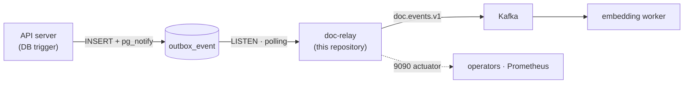
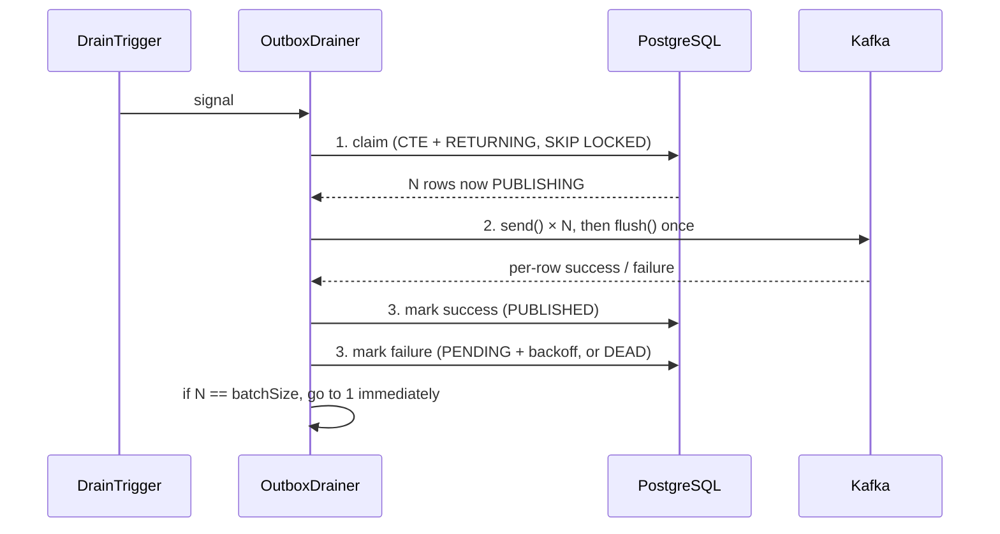
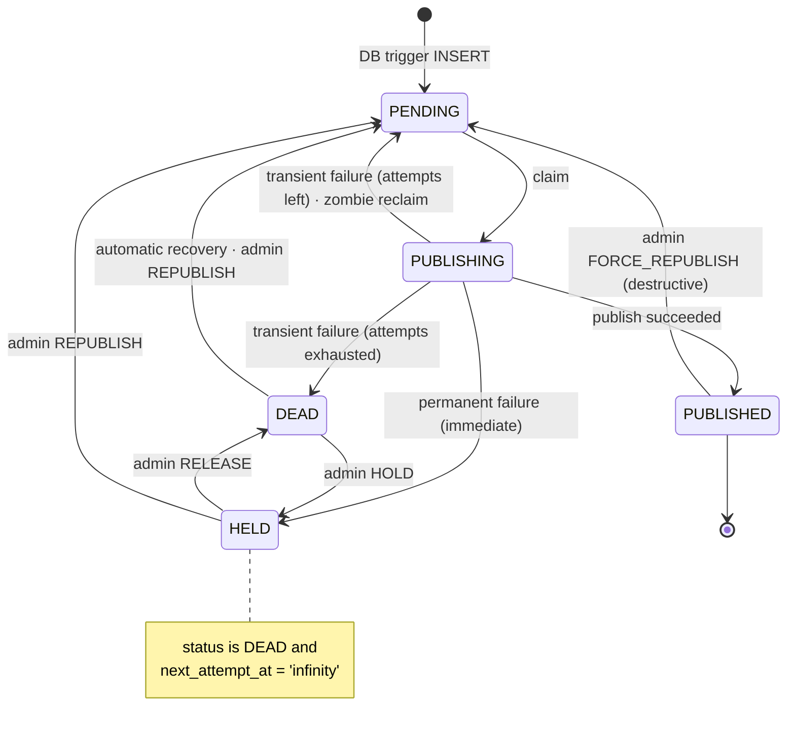

# Relay Architecture

This document describes the Outbox relay server's overall structure, component
responsibilities, signal and publication flows, transaction boundaries, and
major design decisions.

## 1. Purpose and Scope

This document covers the following topics in greater depth than the README:

- Relay responsibilities and external system boundaries
- Design goals and technical constraints
- Internal building blocks and dependency direction
- Runtime flow from signal reception through Kafka publication
- Data used by the relay and transaction boundaries
- Major architecture decisions, quality requirements, and structural limitations

The full definition of the `outbox_event` table and per-column write ownership
belong to the [database schema](https://github.com/mash-up-kr/spr1n6-osscontest-server/blob/main/docs/SCHEMA.md)
in the API server repository. This document describes only what the relay
depends on.

### 1.1 Implementation Baseline

| Area | Current implementation |
|---|---|
| Project structure | Single Gradle module |
| Runtime | Java 21 |
| Language | Kotlin 2.3.21 |
| Application | Spring Boot 4.1.0 |
| DB access | Spring Data JDBC `JdbcClient`, PostgreSQL JDBC 42.7.11 |
| Messaging | Spring for Apache Kafka 4.1.0, Apache Kafka 4.0.0 broker |
| Observability | Micrometer 1.17.0, Prometheus registry |
| Tests | Testcontainers 2.0.5 (PostgreSQL, Kafka) |
| HTTP | None. The application port is closed; only the Actuator management port is used |

## 2. Architecture Goals

| Goal | Why it is needed | How the current design meets it |
|---|---|---|
| Publication that loses no events | If a document is stored but its indexing request never goes out, the user cannot search the document they uploaded — and nobody finds out. | What must be published is recorded in `outbox_event` in the same atomic unit as the document-storing transaction, and the relay treats that table as its only source of truth. A failed publication leaves the row in place, so it goes out again once the cause is gone. |
| A slow Kafka must not hold the DB hostage | Waiting for a broker response while holding a row lock stretches the DB lock by exactly as long as Kafka is slow, delaying reclaim and aggregate queries along with it. | Claiming finishes in one short transaction, and the network call happens after the lock is released. Splitting the cycle into claim, publish, and mark stages comes from this goal. |
| Keep working when the notification path dies | `pg_notify` can be lost, and the LISTEN connection is the first thing to break during failover. | The notification, polling, and admin paths all send only a "wake up" signal; what to publish is always asked of the DB again. If the notification path dies entirely, the relay only slows to the polling interval — it loses no data. |
| Self-recovery of failed publications | Operations do not work if a person must intervene on every broker restart or transient network fault. | Retries use exponential backoff, and rows past the attempt ceiling return to the queue after a recovery delay. Rows left behind by an instance that died mid-publish are reclaimed on lock timeout. |
| Multiple instances running at once | The relay must not be a single point of failure, and there must be room to scale throughput. | The claim query handles contention with `FOR UPDATE SKIP LOCKED`, and result writes verify ownership through `locked_by` and `locked_at`. Adding instances requires no code change. |
| No silent malfunction | If the schema drifts or a configuration relationship breaks, the relay decides there is "nothing to publish", looks healthy, and simply accumulates events. | Schema and timeout budget are validated at startup, and startup halts on a mismatch. The drain thread's state is wired into the health check. |

## 3. Architecture Constraints

### 3.1 Ownership and boundaries

- The schema and migrations for `outbox_event` are owned by the API server
  repository. This repository contains no Flyway migrations, only fixture SQL
  for Testcontainers. Keeping the fixture aligned with the production migration
  is this side's responsibility.
- Creating rows belongs to the DB trigger. The relay never INSERTs or DELETEs in
  `outbox_event`; every write is an UPDATE.
- The relay does not read tables owned by other parts. It never touches
  `indexing_job` or any other table.

### 3.2 Data and transactions

- Network I/O happens only outside transactions.
- All SQL lives in `OutboxRepository`; no other class holds a SQL string.
- There are no JPA entities — SQL is written directly with `JdbcClient`. Hitting
  `SKIP LOCKED` and the partial indexes exactly is the heart of this server, so
  the generated SQL must stay under control.
- Every time column is `TIMESTAMPTZ`, so the application type is uniformly
  `Instant`.

### 3.3 External systems

- Kafka delivery is at-least-once. Exactly-once is not pursued; duplicates are
  absorbed by the receiving side.
- Kafka transactions are not used. Only the idempotent producer is enabled
  (`acks=all`, `enable.idempotence=true`).
- Every timeout, interval, and ceiling is a `relay.*` property; no number is
  hardcoded.

## 4. System Context & Scope



### 4.1 Relay responsibilities

| Task | Description |
|---|---|
| Claim | Turns rows that are `PENDING` and due into `PUBLISHING`, up to the batch size, and fetches them |
| Publish | Assembles rows into envelopes and publishes them to the Kafka topic in a batch |
| Mark result | Records success as `PUBLISHED` and failure as `PENDING` with backoff, or as `DEAD` |
| Reclaim | Returns rows stuck in `PUBLISHING` because the relay died mid-publish to `PENDING` |
| Recover | Revives `DEAD` rows whose recovery time has passed back to `PENDING` |
| Observe and control | Exposes counts by status, the `DEAD` list, republish and hold actions, and Prometheus metrics on the management port |

### 4.2 What the relay does not do

Keeping the boundary narrow is a premise of this design.

| Item | Owner |
|---|---|
| Reclaiming Jobs stalled in the worker | Embedding worker (Kafka offset redelivery) |
| Re-indexing (creating new events) | API server (INSERT of a new outbox row) |
| Out-of-order detection and fencing | Embedding worker |
| Absorbing duplicate processing | Embedding worker (`source_event_id` unique constraint) |
| Retention policy for `PUBLISHED` rows | Undecided. The relay does not delete rows |

### 4.3 A server that accepts no requests

The relay exposes no HTTP endpoints. The application port is closed
(`server.port: -1`) and only the management port opens. Admin actions are
Actuator endpoints, not `@RestController` beans.

Because Actuator's HTTP exposure sits on a servlet container, the
`spring-boot-starter-web` dependency itself is present. The guarantee that no
requests are accepted comes not from the absence of that dependency but from the
two points above plus a test (`NoControllersTest`) that fails if even one
controller bean exists.

## 5. Solution Strategy

| Problem | Choice | Rationale |
|---|---|---|
| Atomicity of transaction and message publication | Act only as the relay in a Transactional Outbox | The DB and Kafka cannot share a transaction, so the problem is reframed: record the intent to publish inside the same DB, then move it |
| Publication latency | `LISTEN/NOTIFY` as the primary path, periodic polling as the safety net | Notifications give immediacy; polling bounds the delay when a notification is lost |
| Contention across instances | Single-statement claim with `FOR UPDATE SKIP LOCKED` | Multiple instances run without application locks or leader election |
| Batch throughput | Send all, then `flush()` once | Round trips drop while per-row success and failure verdicts are preserved |
| Retry storms | Exponential backoff computed as a SQL expression | Attempt counts differ per row, so a single value computed in the application cannot be folded into a batch UPDATE |
| Silent propagation of misconfiguration | Schema and budget validation at startup | Not starting is better than running with the wrong configuration |

## 6. Building Block View

### 6.1 Logical structure

```
doc-relay
├─ Signal path
│   ├─ PgNotificationListener   LISTEN on a dedicated connection. Reconnect + one signal after reconnect
│   ├─ PollingScheduler         Periodic safety net
│   └─ DrainTrigger             Signal coalescing + a single drain thread
│
├─ Publication
│   ├─ OutboxDrainer            Cycle: claim → publish → mark → decide on re-cycling
│   ├─ OutboxRepository         All SQL. Claim / mark / reclaim / recover / aggregate
│   ├─ EnvelopeAssembler        Row → envelope (payload passes through unparsed)
│   ├─ KafkaPublisher           Batch send + flush + success/failure classification
│   ├─ KafkaProducerConfig      acks=all, idempotent producer
│   ├─ FailureClassifier        Permanent vs. transient failure verdict
│   └─ BackoffPolicy            min(base × 2^(n-1), max)
│
├─ Recovery
│   ├─ ZombieRecoveryScheduler  PUBLISHING + expired lock → PENDING
│   └─ DeadRecoveryScheduler    DEAD + time reached → PENDING
│
├─ Lifecycle
│   ├─ SchemaValidator          Schema validation at startup
│   ├─ BudgetValidator          Timeout budget validation at startup
│   └─ DrainerHealthIndicator   Drain thread state
│
└─ Observability / control
    ├─ RelayMetrics             Micrometer instrumentation + gauge refresh
    └─ OutboxEndpoint           Query / republish / hold / release
```

### 6.2 Main building blocks

| Component | Responsibility | Notes |
|---|---|---|
| `DrainTrigger` | Merges the three signal paths into one and owns the drain thread | A capacity-1 queue coalesces signals. Exactly one drain cycle runs at a time |
| `OutboxDrainer` | Orders the stages of one cycle and marks the results | If the claimed count equals the batch size, a backlog remains, so the next cycle starts immediately |
| `OutboxRepository` | All claim, mark, reclaim, recover, and aggregate SQL | Every SQL statement in this repository lives here. It must hit the partial indexes and `SKIP LOCKED` precisely |
| `EnvelopeAssembler` | Assembles a row into the Kafka message body | Does not interpret `payload`, does not branch on `eventType`, and fills top-level fields only from columns |
| `KafkaPublisher` | Batch publication and per-row success/failure classification | Only rows whose envelope assembly failed go to the failure list; the rest are still published |
| `FailureClassifier` | Identifies failures whose outcome will not change on retry | When unsure, it classifies as transient |

## 7. Runtime View

### 7.1 Signal path

There are three ways to learn that a new event exists, and all of them converge.

```
  PgNotificationListener ─┐   the trigger's pg_notify arrived,
  PollingScheduler ───────┼─→ the interval came around,       ─→ DrainTrigger.signal() ─→ one drain thread
  OutboxEndpoint ─────────┘   a person pressed REPUBLISH
```

**All three send only "wake up".** None of them decides what gets published.
Whichever path did the waking, the drain cycle asks the DB again for rows that
are `PENDING` and due. Adding another path, or losing one, does not change the
publication logic.

**DB notification** — a dedicated connection, not one from the pool, holds
`LISTEN outbox_event`. The event UUID carried by the notification is never used
as a lookup key: treating notifications as the source of truth would mean a lost
notification's event is never published. Right after reconnecting, one signal is
always fired to compensate for notifications lost while disconnected. A LISTEN
connection looks idle while waiting, so a separate keepalive interval keeps the
DB's `idle_session_timeout` from cutting it.

**Polling** — fires a signal on a fixed interval. The scheduler itself never
queries the DB, so this path stays unblocked even when the DB is slow or down.

**Signal coalescing** — `DrainTrigger` holds exactly one fact: "another cycle is
needed". A capacity-1 queue carries that fact, so a thousand signals cause at
most one extra drain. When the queue is full a new signal is silently dropped;
since what is held and what is dropped are the same fact, no information is
lost. A thousand accumulated events still wake the thread once — the cycle then
repeats internally until the backlog drains.

### 7.2 Drain cycle

A cycle has three stages, and network I/O happens only outside transactions.



**1. Claim** — selecting, marking, and fetching all finish inside one statement.
`ORDER BY next_attempt_at, id` matches the column order of `idx_outbox_pending`,
so no sort is added and a single index serves `WHERE`, `ORDER BY`, and `LIMIT`.
Splitting SELECT from UPDATE would open a window to lose the lock in between —
or, in the other direction, to leave the database while still holding it. One DB
round trip.

**2. Publish** — the whole batch is pushed into the producer buffer and a single
`flush()` collects the responses. `send()` does not go over the network; it
returns immediately, and `flush()` groups what accumulated by partition and
sends it. This reduces round trips without skipping verification: after
`flush()`, each row's `Future` is opened to separate success from failure. Some
rows failing within a batch is normal.

**3. Mark** — successes go down in one statement; failures are **grouped by
error message**, one UPDATE per group. Rows that will carry the same message
share `last_error_message`, so they fit in one statement. When the broker dies
entirely the whole batch fails with the same exception, leaving a single group —
the worst outage is handled the most cheaply. The happy path makes three DB
round trips per cycle.

### 7.3 Message contract

```
Topic     doc.events.v1        (partitions = 3)
Key       document_id (String)  ← preserves per-document order. Do not change
Headers   eventId / traceId / schemaVersion
Producer  acks=all, enable.idempotence=true
Delivery  at-least-once
```

The envelope consists of top-level fields restored from columns plus the
`payload` passed straight through.

```json
{
  "eventId": "...",
  "tenantId": 1,
  "documentId": 42,
  "documentVersionId": 137,
  "eventType": "INDEXING_REQUESTED",
  "schemaVersion": 1,
  "occurredAt": "2026-08-13T09:14:22Z",
  "payload": { }
}
```

Three principles hold. **`payload` is not parsed** — the raw JSONB is inserted as
a JSON node, so the relay does not change when a partner adds a field. **There
is no branching on `eventType`** — the column value is copied, so a new event
type requires no change here. **Top-level fields are restored from columns** —
values are never lifted out of the payload. `documentVersionId` can be `NULL`
for `DOCUMENT_DELETED`, and the field is emitted as `null` rather than omitted:
if a field's presence varied by event type, the receiving side would have to
branch on type.

`event_schema_version` and `trace_id` are the two columns the relay moves
without interpreting. `schemaVersion` goes to an envelope field and a header;
`trace_id` goes to a Kafka header and the log MDC. `trace_id` is necessary
because events are born from a DB trigger: a transaction boundary and an
asynchronous publication sit between the upload request and the Kafka message,
so without this value there is no way to connect a message back to the user
request that started it.

## 8. Data & State Model

### 8.1 What the relay expects

The full definition of `outbox_event` is owned by the API server repository.
What the relay depends on is:

| Target | The relay's dependency |
|---|---|
| Columns | `id`, `tenant_id`, `document_id`, `document_version_id`, `event_type`, `event_schema_version`, `payload`, `trace_id`, `status`, `publish_attempt_count`, `next_attempt_at`, `locked_by`, `locked_at`, `published_at`, `last_error_message`, `created_at` |
| Constraints | `status` must permit `DEAD`; `next_attempt_at` must be `NOT NULL` |
| Indexes | `idx_outbox_pending (next_attempt_at, id) WHERE status = 'PENDING'`, `idx_outbox_stuck (locked_at) WHERE status = 'PUBLISHING'` |
| Notification | The trigger must fire `pg_notify('outbox_event', <id>)` |

The column order of `idx_outbox_pending` must match the claim query's
`ORDER BY`. If it does not, every cycle adds a sort.

### 8.2 Columns the relay writes

| Column | Permission |
|---|---|
| `status` · `locked_by` · `locked_at` · `next_attempt_at` · `publish_attempt_count` · `published_at` · `last_error_message` | UPDATE |
| `payload` · `trace_id` · `event_schema_version` · everything else | Read only |

`retry_of_event_id` is written by the API server when re-indexing is requested;
the relay neither reads nor publishes it.

### 8.3 State transitions



`HELD` is not a separate status value. `status` is still `DEAD`; it denotes rows
whose `next_attempt_at` is `'infinity'`. The automatic recovery query selects on
`next_attempt_at <= now()`, so these rows are never picked up. No additional
status was introduced in order to avoid touching the partner-owned
`ck_outbox_status` constraint.

Held rows are counted separately because the status value alone does not
distinguish what will recover on its own from what needs a person. The admin
aggregate splits the two into `dead` and `held`.

### 8.4 Where duplicate publication occurs

If the process dies after receiving the Kafka ack but before committing the
result, that row stays `PUBLISHING`, is reclaimed as a zombie, and is published
again.

This is normal under the at-least-once contract and is absorbed by worker
idempotency (`source_event_id` uniqueness, chunk UPSERT). Eliminating it would
require binding Kafka and DB transactions together, which is not worth it. The
contract is pinned down by a test that documents the contract rather than one
that catches a bug.

## 9. Cross-cutting Concepts

### 9.1 Failure classification and backoff

Publication failures split into permanent and transient. Only failures whose
outcome will not change on retry are classified as permanent; when unsure, the
verdict is transient. Retrying wrongly wastes effort, but declaring permanence
wrongly stops an event that must not stop.

| Class | Cases | Handling |
|---|---|---|
| Permanent | Envelope assembly failure, `RecordTooLargeException`, `TopicAuthorizationException`, `InvalidTopicException` | Straight to `DEAD` with `next_attempt_at = 'infinity'`, no retry |
| Transient | Every other exception | `PENDING` with backoff; on reaching the attempt ceiling, `DEAD` with a recovery time |

The verdict walks the exception's cause chain from the exception itself to the
end. The point is not to count how many layers wrap it. Wrapping depth is a
library concern, so the same failure arrives at different depths depending on
the path — a failure the producer rejects before sending is one layer, while a
broker rejection delivered through the callback gains two. Fixing the depth
means silently drifting the moment that concern changes.

Backoff is computed as a SQL expression, not in the application. Attempt counts
differ per row, so passing a single value computed in the application would make
the batch UPDATE impossible to fold.

```sql
next_attempt_at = now() + LEAST(:baseSeconds * POWER(2, publish_attempt_count), :maxSeconds)
                          * INTERVAL '1 second'
```

### 9.2 Recovery paths

**Zombie reclaim** — rows that are `PUBLISHING` with a `locked_at` older than the
lock timeout return to `PENDING`. The attempt count rises and backoff is applied,
but the row always becomes `PENDING`, never `DEAD`, even past the ceiling —
reclaim is caused by an instance's death, not by the event's own failure.

**DEAD automatic recovery** — rows that are `DEAD` with `next_attempt_at` in the
past return to `PENDING` with the attempt count reset to `0`. Rows at
`'infinity'` do not match the condition and never revive on their own.

### 9.3 Ownership verification

In a system with a reclaim mechanism, a row's ownership can change mid-cycle.
Result-marking UPDATEs always verify three conditions together.

```sql
WHERE id IN (:ids) AND status = 'PUBLISHING'
  AND locked_by = :instanceId AND locked_at = :claimedAt
```

Without this check, a slow cycle that was reclaimed could return late and
overwrite the state of a row another instance has already claimed. Rows that the
condition excluded are counted as `relay_stale_write_total`.

### 9.4 Time budget

One cycle's maximum duration must be shorter than the zombie reclaim timeout. If
that relationship breaks, reclaim takes a batch that is still being published,
and the contention that ownership verification exists to block actually happens.

```
kafka.producer.max-block + kafka.producer.delivery-timeout + DB round-trip allowance (10s)
    < zombie.lock-timeout
```

`BudgetValidator` verifies this at startup and halts startup on a mismatch. It is
the kind of relationship that breaks silently when configuration is changed
carelessly.

### 9.5 Observability

| Kind | Metrics |
|---|---|
| Counters | `relay_publish_total{result}`, `relay_dead_transition_total`, `relay_dead_recovery_total`, `relay_zombie_reclaim_total`, `relay_listener_reconnect_total`, `relay_forced_republish_total`, `relay_stale_write_total`, `relay_mark_failure_total` |
| Gauges | `relay_outbox_pending`, `relay_outbox_dead`, `relay_outbox_held`, `relay_listener_connected` |
| Distributions | `relay_publish_latency_seconds{attempt}`, `relay_drain_batch_size` |

`relay_dead_transition_total` is necessary because automatic recovery resets the
attempt count to `0`. The DB alone cannot tell which iteration of a
`DEAD ↔ PENDING` cycle an event is on, and this counter is the only window onto
that cycle.

The health groups are split in two. A dead drain thread is a problem a restart
fixes, so it goes in `liveness`; a severed LISTEN connection does not, because
polling covers for it.

### 9.6 Startup and shutdown

At startup `SchemaValidator` validates the schema through `information_schema`
and `pg_catalog` queries.

| Check | On mismatch |
|---|---|
| Required columns exist | Halt startup |
| `next_attempt_at` is `NOT NULL` | Halt startup |
| The `status` constraint permits `DEAD` | Halt startup |
| Both indexes exist | Warning log |

Attached to a DB where `next_attempt_at` is nullable, the claim query silently
returns zero rows, and the relay decides there is "nothing to publish" and looks
healthy. Events pile up with nobody aware, so a loud failure is better. Missing
indexes still produce correct results and only slow things down, so they warrant
only a warning.

At shutdown the relay waits up to a bounded time for the in-flight cycle to
finish. A container's `stop_grace_period` must be longer than that bound; if it
is shorter, `SIGKILL` arrives before the drain completes.

## 10. Architecture Decisions

| Decision | Alternative | Reason |
|---|---|---|
| Three-stage split of claim, publish, mark | Claim through publish inside one transaction | Going to the network while holding a lock lets the slow side hold the fast side hostage |
| Notifications used only as signals | Look up the target by the notification's event ID | Treating notifications as the source of truth means a lost notification's event is never published |
| Direct SQL with `JdbcClient` | JPA / Spring Data repositories | Hitting `SKIP LOCKED` and the partial indexes exactly is the core, so the generated SQL must stay controlled |
| No separate `HELD` status value | Add a status to `ck_outbox_status` | The same effect is achieved with `next_attempt_at = 'infinity'` without touching a partner-owned constraint |
| Admin exposed as Actuator endpoints | `@RestController` | Actions are exposed only on the management port while the application port stays closed |
| Idempotent producer only | Kafka transactions | At-least-once is pinned down as the contract without paying the exactly-once cost |
| Admin actions also perform only UPDATE | INSERT a new row on republish | Republishing that creates a new row is re-indexing, and its owner is the API server |

## 11. Quality Requirements

| Quality attribute | Scenario | Response |
|---|---|---|
| Integrity | The relay is killed mid-publish | Zombie reclaim returns `PUBLISHING` rows, and worker idempotency absorbs the duplicate publication |
| Availability | The LISTEN connection is severed | The polling safety net takes over, and one signal after reconnect compensates for lost notifications |
| Availability | The Kafka broker is down for a long time | Backoff retries, and rows past the attempt ceiling revive after the recovery delay |
| Scalability | Several relays are started | `SKIP LOCKED` claiming and ownership verification work with no code change |
| Operability | A specific event cycles endlessly | It is observed through `relay_dead_transition_total` and stopped with `HOLD` |
| Safety | The management port is exposed externally | The default bind is `127.0.0.1`, and write actions are protected by a token |

## 12. Architecture Risks & Limitations

| Item | Description |
|---|---|
| Unbounded growth of `PUBLISHED` rows | The relay does not delete rows and there is no retention policy. As the table grows, the `DEAD` and `held` aggregates — which have no partial index — become correspondingly expensive. Adding an index does not stop the growth itself, so the two problems are separate |
| Seq Scan on `DEAD` queries | There is no partial index matching `DEAD`, so the aggregate reads the whole table. This is accepted on the premise that `DEAD` rows are few |
| Schema validation depends on names | Constraints and indexes are looked up by name, so a partner renaming one breaks validation even when the schema is correct |
| Single drain thread | One cycle runs at a time per instance. Throughput scales through batch size and instance count |
| Envelope shape | The top-level field set is agreed with the worker side; changing it means changing `EnvelopeAssembler` and its tests together |

## 13. Design Principles

1. **Never go to the network while holding a lock.** The slow side must not hold
   the fast side hostage.
2. **Signals only wake; what to publish is always asked of the DB again.** That
   is why losing the entire notification path loses no data — it only slows
   things down.
3. **No terminal state; instead, let a person stop things.** The cost is paid
   with the existing hold switch rather than a new state.
4. **Assume ownership can change mid-cycle.** In a system with a reclaim
   mechanism, result writes must always verify ownership.
5. **The retry budget must fit inside the reclaim timeout.** The moment it
   exceeds, reclaim intercepts normal operation.
6. **The relay never INSERTs or DELETEs in `outbox_event`.** Every write is an
   UPDATE, and the admin path is no exception.
7. **Do not read another team's tables.** Judgments that require knowing the
   meaning of someone else's table belong to whoever owns that table.
8. **When unsure, choose to retry.** Retrying wrongly wastes effort; stopping
   wrongly means the data never goes out.
9. **A loud failure beats a silent one.** A drifted schema blocks startup, and so
   does a broken budget.
10. **If it cannot be detected, it is not a defense.** Protective logic not wired
    into the health check may as well not exist.
11. **Exactly-once is not pursued.** At-least-once is pinned down as the
    contract, and duplicates are absorbed by the receiving side.

## 14. Related Documents

| Document | Contents |
|---|---|
| [README](../README_EN.md) | How to run, environment variables, tuning values, operational endpoints |
| [Fault injection demo](../demo/README_EN.md) | How the five scenarios are built and how zero loss is confirmed |
| [Code conventions](CODE_CONVENTIONS_EN.md) | Rules for comments, readability, structure, failure handling, tests, and commits |
| [Database schema](https://github.com/mash-up-kr/spr1n6-osscontest-server/blob/main/docs/SCHEMA.md) | Full `outbox_event` definition, per-column write ownership, triggers (owned by the API server repository, written in Korean) |
